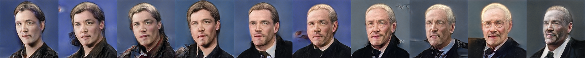
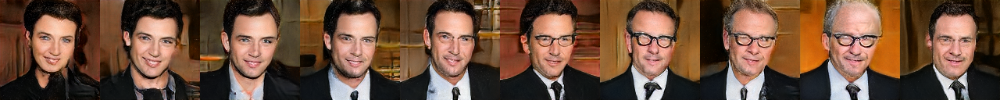
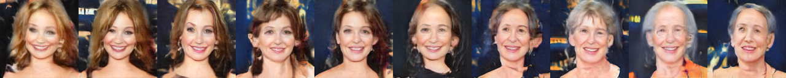
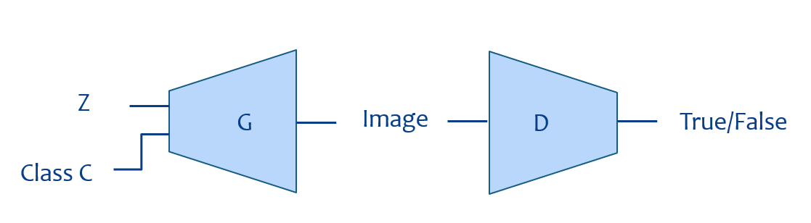
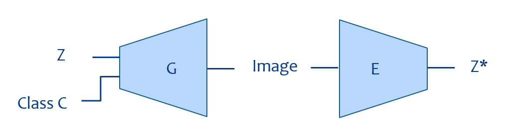
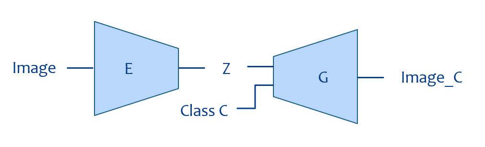

## Face Aging using Conditional GAN  

Performing Face Aging (directed image generation) using StyleGAN2-ADA and InceptionResnetV1.

This repository is built upon the repositories of [StyleGAN2-ADA Pytorch](https://github.com/dvschultz/stylegan2-ada-pytorch), [Facenet PyTorch](https://github.com/timesler/facenet-pytorch) and [Processed IMDB WIKI Dataset](https://github.com/imdeepmind/processed-imdb-wiki-dataset).

- Final project to course 046211 - Deep Learning in the Technion
- by Udi Gal & Moshe Rafaeli

## Contents

External repositories:
- StyleGAN2-ADA repository contents (under main directory)
- Facenet repository contents (under `facenet_encoder\ `)
- Processed IMDB WIKI Dataset repository contents (under `processed-imdb-wiki-dataset\ `)

Additions in this repository:

| Path    | Description
| :-----  | :----------
| `046211_project_repo`                           | Main directory
| &ensp;&ensp;&boxvr;&nbsp; `directed_image_generation.ipynb` | Directed generation of image based on input image and class
| &ensp;&ensp;&boxvr;&nbsp; `make_json_labels.py` | Create multiclass json labels file for stylegan2-ada-pytorch
| &ensp;&ensp;&boxvr;&nbsp; `train_inception_resnet_v1.ipynb` | Setup and training for the InceptionResnetV1 encoder
| &ensp;&ensp;&boxur;&nbsp; `train_sg2_ada.ipynb` | Setup and training for the StyleGAN2-ADA generator

## Directed image generation

To perform directed image generation, refer to the `directed_image_generation.ipynb` file and follow the instructions. In order to run it you will need:
- A trained generator pickle file (`generator_pkl`)
- A trained encoder pytorch file (`encoder_pt`)
- An input image (`input_path`)

## Training the Generator

To train the generator over different dataset, refer to the `train_sg2_ada.ipynb` file and follow the instructions. In order to run it you will need:
- A dataset to train on (`dataset_path`)
- A starting point trained generator (optional - `resume_from`)
- The training code is located at `train.py` with all the relevant documentation

## Training the Encoder

To train the encoder again, refer to the `train_inception_resnet_v1.ipynb` file and follow the instructions. In order to run it you will need:
- A trained generator pickle file (`generator_pkl`)
- You can optimize the training hyper-parameters for your needs.

## How does it work

The goal of the project is to enable converting between the image space and latent space easily, and with these conversions perform the directed generation.

**Generation: Converting between Latent Space to Image Space**

* We use a conditional StyleGAN2-ADA model as our generator.
* We trained the generator over the IMDB-WIKI dataset (after pre-processing) labeled with age groups of `[0-10]`, `[11-20]`, `[21-30]`, `[41-50]`, `[51-60]`, `[61-70]`, `[71-80]`, `[81-90]`, `[91-100]`.
* After we finished training we have a generator that can generate faces according to latent variables and a class.

**Encoding: Converting between Image Space to Latent Space**

* We use an InceptionResnetV1 model as our encoder. The goal of the encoder is to learn the distribution of the latent space that was learned by the generator, and to reproduce the latent variables from an image.
* We trained the encoder over 10,000 randomly generated images from the generator and their corresponding latent variables, using MSE to calculate the loss between the encoding and the actual latent variables.
* It is important to see that the encoder does not consider the class of the image as and input, and that is to ensure that the encoder will be able to identify two images with the same latent variables but different class.

**Directed Generation: Combining the Encoder and the Generator**

Now we have a generator and en encoder, so we can use them to perform the directed generation.
* For a given image, the encoder calculates the latent variables of input image.
* Then, the latent variables and the given class go into the generator to create the appropriate image that will transfer the class of the input image to the new class, and hopefully preserve the characteristics of the input image.

## References:

1. [StyleGAN2-ADA Pytorch](https://github.com/dvschultz/stylegan2-ada-pytorch) - Nvidia Labs, October 2021
2. [Facenet PyTorch](https://github.com/timesler/facenet-pytorch) - Tim Esler, December 2021
3. [Processed IMDB WIKI Dataset](https://github.com/imdeepmind/processed-imdb-wiki-dataset) - Abhishek Chatterjee, March 2019

## License

Copyright &copy; 2021, NVIDIA Corporation. All rights reserved.

This work is made available under the [Nvidia Source Code License](https://nvlabs.github.io/stylegan2-ada-pytorch/license.html).
